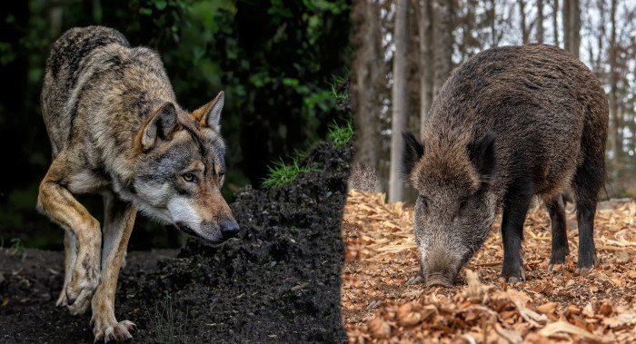
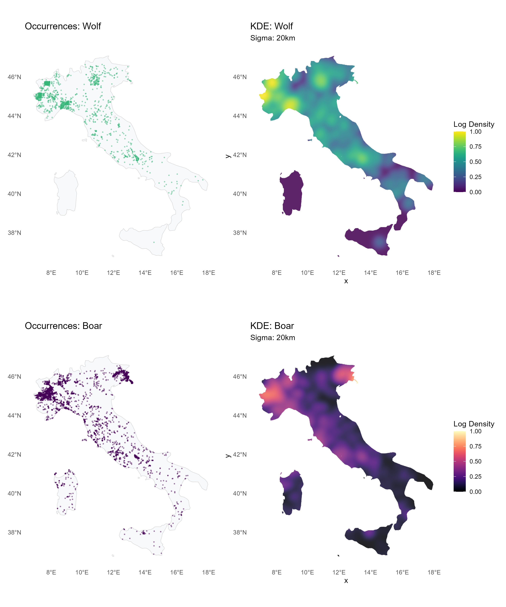
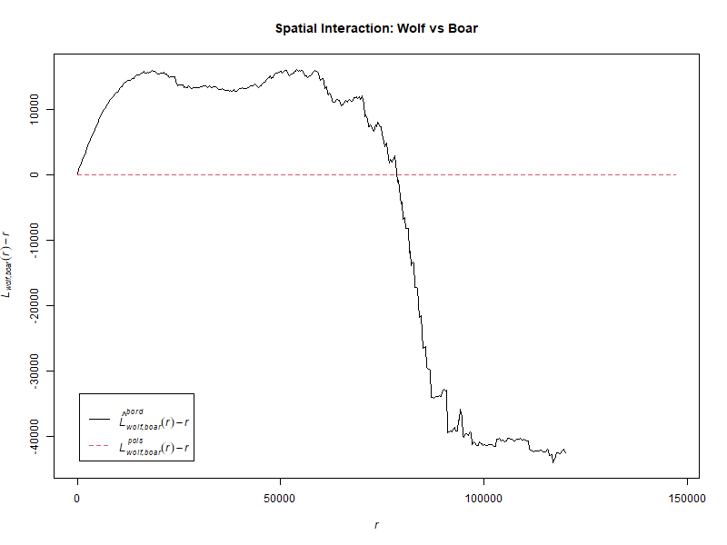
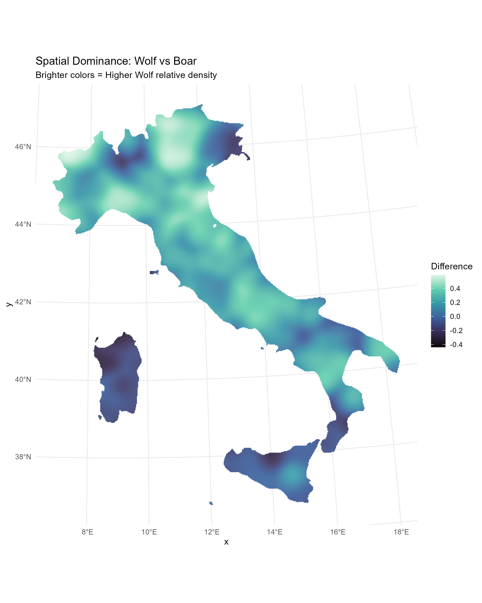

# Predator-Prey Spatial Interaction Analysis: Wolf (*Canis lupus*) vs. Wild Boar (*Sus scrofa*) in Italy

This project explores the spatial relationship between wolves (predator) and wild boars (prey) across the Italian territory using GBIF occurrence data and Spatial Point Pattern Analysis.



## Research Question
Do high density areas for wolves coincide with high density areas for Boar? If so, At what distance ($r$) is the spatial attraction between the two species most significant?

# Data and Methodology
Data was downloaded using GBIF through the rgbif package. Domestic dogs and pigs were cleaned from the dataset to ensure data integrity. The Kernel Density estimation was performed using a sigma equal to 20km for both species, because it represents a realistic movement range for these large mammals. For the coordinate system, all data was projected to EPSG:32632 (UTM 32N) to allow for accurate distance measurements in meters. A log-transformation was applied to the density surfaces to handle the high variance in occurrence intensity and highlight subtle spatial trends. The analysis was performed entirely in R.

## Packages used
Here are the packages used in the project. 
- `rgbif` allows R to access directly to the GBIF servers to download occurrence recorods
- `sf` treats geographic data (points, polygons) like a data frame, making it easy to crop, project and transform coordinates.
- `spatstat` was used for the Point Porcess objects (ppp) and calculating the KDE and L-cross interaction.
- `rnaturalearth` provided italy's borders used as the window of the analysis.
- `viridis` provided color scales designed to be read by everyone, including color blind people.
- `ggplot2` was used to build the maps and charts
- `patchwork` was used to combine the obtained plots into a single image. 

## First Steps
Before loading the data, we must define the study area. The `rnaturalearth` package was used to get Italy's borders and project them into UTM Zone 32N (EPSG:32632). This ensures that all distance-based calculations (like the 20km sigma) are measured accurately in meters rather than degrees.

```R
italy <- ne_countries(country = "Italy", scale = "medium", returnclass = "sf") |>
  st_transform(32632)
italy_poly <- as.owin(italy)
```
## Data Acquisition 
We retrieve occurrence data from GBIF. To ensure data integrity, we filter out domestic variants (e.g., "familiaris" or "domestic") and remove duplicate coordinates that would otherwise cause artificial density "spikes."

```R
load_species_sf <- function(taxon_key, exclude_pattern = NULL) {
  data <- occ_search(taxonKey = taxon_key, country = "IT", hasCoordinate = TRUE, limit = 10000)$data
  data <- data[, c("decimalLongitude", "decimalLatitude", "scientificName")]
  data <- data[!is.na(data$decimalLongitude) & !is.na(data$decimalLatitude), ]
  
  if (!is.null(exclude_pattern)) {
    data <- data[!grepl(exclude_pattern, data$scientificName, ignore.case = TRUE), ]
  }
  
  data <- data[!duplicated(data[, c("decimalLongitude","decimalLatitude")]), ]
  
  sf_points <- st_as_sf(data, coords = c("decimalLongitude", "decimalLatitude"), crs = 4326) |>
    st_transform(32632)
  
  return(sf_points[st_intersects(sf_points, italy, sparse = FALSE), ])
}

# Fetching Data
wolf_sf <- load_species_sf(5219173, "familiaris")
boar_sf <- load_species_sf(7705930, "domestic|familiaris")
```

## Kernel Density Estimation and Normalization
To analyze the spatial relationship between species, we must move from discrete "points" to a continuous "intensity surface." This process allows us to identify hotspots and areas of low activity across the entire Italian landscape.

We convert the coordinate data into a Point Pattern Object. This is required by the `spatstat` package that links the occurrence points to our defined geographic window (Italy).
```R
wolf_ppp <- ppp(st_coordinates(wolf_sf)[,1], st_coordinates(wolf_sf)[,2], window = italy_poly)
boar_ppp <- ppp(st_coordinates(boar_sf)[,1], st_coordinates(boar_sf)[,2], window = italy_poly)
```
We then apply a KDE with a Sigma of 20km. This acts as a smoothing radius, also reflecting a realistic ecological scale for large mammals. `dimyx` is set to 51 to create a high resolution grid for the final maps. 
```R
wolf_dens <- density(wolf_ppp, sigma = 20000, dimyx = 512)
boar_dens <- density(boar_ppp, sigma = 20000, dimyx = 512)
```
Species occurrence data is often highly skewed, with a few areas having massive numbers of sightings while most have very few. To account for this and compare both datasets fairly, we created a custom function `apply_log_norm`, that performs a logarithmic transformation. This makes subtle patterns in lower-density areas more visible alongside high-density hotspots. This function also normalizes the data, scaling the values between 0 and 1. 
```R
apply_log_norm <- function(dens_obj) {
  offset <- max(dens_obj$v, na.rm = TRUE) / 1000
  dens_obj$v <- log(dens_obj$v + offset)
  dens_obj$v <- (dens_obj$v - min(dens_obj$v, na.rm=T)) / 
    (max(dens_obj$v, na.rm=T) - min(dens_obj$v, na.rm=T))
  return(dens_obj)}

wolf_dens_log <- apply_log_norm(wolf_dens)
boar_dens_log <- apply_log_norm(boar_dens)
```

## Plotting functions
Functions are used to guarantee that both Wolf and Boar maps have the exact same criteria used. It's also efficient, we can generate all four maps with lesser lines of code. 

### Occurence plots
The `plot_occ` function is used to plot the individual occurrence points, so raw GBIF data, over Italy. We set `size = 0.3` and `alpha = 0.4`. Using a low alpha (transparency) is crucial; it prevents "overplotting" where points stack on top of each other, allowing us to see where sightings are most densely clustered.
```R
plot_occ <- function(sf_points, species_label, color_p) {
  ggplot() +
    geom_sf(data = italy, fill = "#f8f9fa", color = "grey80", linewidth = 0.2) +
    geom_sf(data = sf_points, color = color_p, size = 0.3, alpha = 0.4) +
    labs(title = paste("Occurrences:", species_label)) + 
    theme_minimal() + theme(panel.grid = element_blank())
}
```
### Density plots
The `plot_dens` function converts our mathematical KDE results into a visual heatmap. We convert the `spatstat` density object into a coordinate grid. `geom_raster` is used to draw the continuous color surface, covering the entire study area. High density areas are recognized thanks to the `scale_fill_viridis`. There are two `geom_sf` calls, the first is to draw the background and the second to draw a thin white border over the density colors, to clearly define the coastline of italy. 
```R
plot_dens <- function(dens_obj, species_label, palette) {
  df <- as.data.frame(dens_obj)
  colnames(df) <- c("x", "y", "value")
  
  ggplot() +
    geom_sf(data = italy, fill = "#eeeeee", color = NA) +
    geom_raster(data = df, aes(x=x, y=y, fill=value), alpha = 0.85) +
    scale_fill_viridis(option = palette, name = "Log Density") +
    geom_sf(data = italy, fill = NA, color = "white", linewidth = 0.1) +
    labs(title = paste("KDE:", species_label), subtitle = "Sigma: 20km") +
    theme_minimal() + theme(panel.grid = element_blank())}
```
## Final layout
Finally, we use the `patchwork` package, so we can see the plots side by side, ready to be compared instantly. The plots were placed into a single 2x2 grid. 
```R
p1 <- plot_occ(wolf_sf, "Wolf", "#35b779")
p2 <- plot_dens(wolf_dens_log, "Wolf", "viridis")
p3 <- plot_occ(boar_sf, "Boar", "#440154")
p4 <- plot_dens(boar_dens_log, "Boar", "magma")
(p1 + p2) / (p3 + p4)
```

## Statistical Analysis
Maps are useful for visual estimations of our data, but we need statistics to confirm our observations. We use two different methods: one for the raw points and one for the density surfaces.

### L-cross Function
We "superimpose" the two species into a single multi-type point pattern. The L-cross function then measures the average number of Boars found within a distance $r$ of a Wolf. We then plot it as *L(r)-r* to make it easy to read. If the solid black line is above the red dashed line (the null model), it indicates spatial attraction.
```R
multi_ppp <- superimpose(wolf = wolf_ppp, boar = boar_ppp)
ck <- Lcross(multi_ppp, "wolf", "boar", correction="border")
plot(ck, . - r ~ r, main="Spatial Interaction: Wolf vs Boar")
```

### The Spearman Rank Correlation
We perform a pixel-by-pixel correlation between the two KDE surfaces. Spearman was chosen due to it's non-parametric nature. It looks at the rank of the density rather than the raw values, making it much better at handling the "clumpy" nature of wildlife data and any remaining outliers. A value closer to +1 indicates that as Boar density increases, Wolf density increases predictably.
```R
spearman_rho <- cor(as.vector(wolf_dens_log$v), as.vector(boar_dens_log$v), 
                    method = "spearman", use = "complete.obs")
print(paste("Spearman Correlation:", round(spearman_rho, 4)))
```

## The Density Difference Map
This maps tries to analyze in which parts of Italy is the wolf more established relative to its prey, and vice versa. We treat the two normalized surfaces as layers in a "spatial calculator." By subtracting the Boar values from the Wolf values. Positive values (Brighter colors) area ssociated with areas where the wolf's relative intensity is higher than the boar's. Negative values (darker colors) are a reas where the Boar's intensity is higher than the Wolf's.
```R
diff_df <- as.data.frame(wolf_dens_log)
colnames(diff_df) <- c("x", "y", "wolf_val")
diff_df$boar_val <- as.data.frame(boar_dens_log)$value
diff_df$diff <- diff_df$wolf_val - diff_df$boar_val

ggplot() +
  geom_sf(data = italy, fill = "grey95", color = NA) +
  geom_raster(data = diff_df, aes(x=x, y=y, fill=diff), alpha = 0.9) +
  scale_fill_viridis_c(option = "mako", name = "Difference") +
  geom_sf(data = italy, fill = NA, color = "white", linewidth = 0.1) +
  labs(title = "Spatial Dominance: Wolf vs Boar", 
       subtitle = "Brighter = Wolf dominance | Darker = Boar dominance") +
  theme_minimal() + theme(panel.grid = element_blank())
```

# Results + Discussion
## The Plot Grid
These were all the plots produced by the functions, placed on a single 2x2 grid. 



### Interpretation
Both species show some spatial clustering rathere than uniform coverage in the territory, in the Western Alps for wolves and boars and also the eastern-most tip of Friuli-Venezia Giulia for Boars. This is probably not the real ecological distribution of these species and there is sampling bias, more records where people are and where there are more monitoring projects. 

The Wolf shows high-density areas in the appennines and parts of the alps, with weaker but continuous density along the appennine. Wolves usually prefer low human density and good connectivity along its territory, which makes sense in this distribution. The Appennines acts as a long corridor along Itally, serving as a dispersal route for the species. 

The Po Plain and the south, on the contrary, are low density. This could be explained with more human presence and activity, limiting the distribution. The Isalnds are completely empty. The KDE suggests range expansion with strong reliance on mountainous corridors.

We could conclude that the Wolf's distribution looks like a recovering apex predator, that recently came back to the territory and whose distribution is more constrained by human pressure rather than climatic factors. 

The Boar shows a more broader and continuous coverage in the North and along the Appennine corridor. This makes sense due to the species being more of a generalist, with high reproductive rate and tollerating more human presence. Boars, differently from wolves, can thrive in fragmented habitats and mixed agro-forest landscapes. 

The Po Plain still shows some moderate density, unlike wolves. Boars could be exploiting crops and edge habitats in their favor. 

## L-cross Plot
This is the L-cross function graph produced. 



### Interpretation
The red dashed line represents complete spatial randomness, so there is no spatial correlation between predator and prey and they just land randomly. The black solid line is the observed data, showing how the actual distribution of wolves relates to distribution of boars. 

The graph is split into two distinct phases based on distance (r): Between distances of 0 and 80km, the black line is above the red one. At these scales, wolves are found in close proximity to boars much more often than chance would predict. This confirms positive spatial coupling. Wolves are actively selecting territories within the "home ranges" of boar populations. It suggests that prey availability is a primary driver for where wolf packs establish themselves.

The line then plummets around 80km. Here, the relationship shifts to spatial repulsion or simply a lack of correlation. This likely represents the "edge" of regional ecosystems or the geographic limits of the Apennine/Alpine ridges. It shows that the "wolf-boar link" is a localized phenomenon—once you move too far away from a specific prey hotspot, the predator density drops off because you've likely moved into a different habitat type (like an urbanized valley or a different mountain range).

The L-cross function confirms a statistically significant spatial attraction between Canis lupus and Sus scrofa. The observed pattern (black line) remains consistently above the null model (red line) for distances up to 80km, peaking between 20-60km. This suggests that wolf presence is strongly anchored to prey-dense regions, providing quantitative support for the predator-prey tracking hypothesis.

## Density Difference Map + Spearman 



### Interpretation

The analysis yielded a Spearman’s rank correlation coefficient ($\rho$) of 0.62. This indicates a statistically significant, strong positive correlation between the two species' density surfaces. It is also evidence of a numerical response, the mechanism where a predator population increases in density in response to an increase in prey density. 

The Density Difference Map reveals the fine-scale spatial balance between predator and prey. Brighter regions indicate areas of high relative Wolf establishment, particularly along the mountainous backbone of Italy. Conversely, darker regions highlight 'prey reservoirs'—high-density Boar areas that may represent future expansion fronts for the Wolf population. This spatial heterogeneity, combined with a positive Spearman correlation, illustrates a dynamic recolonization process where the predator follows the prey's footprint.

# Conclusion

Ultimately, the spatial analysis confirms that high density areas for both species coincide. The Spearman’s of 0.62 confirms that as Boar density increases, Wolf density follows a predictable upward trend. The spatial attraction between the two species is most significant at a distance of 20km to 60km. As shown by the L-cross function, this range represents the peak deviation from randomness, suggesting that the predator-prey link is strongest at the scale of regional pack territories and dispersal distances. The data proves that the Wolf’s recolonization of Italy is not a random expansion, but a statistically measurable "tracking" of its primary prey's footprint.


